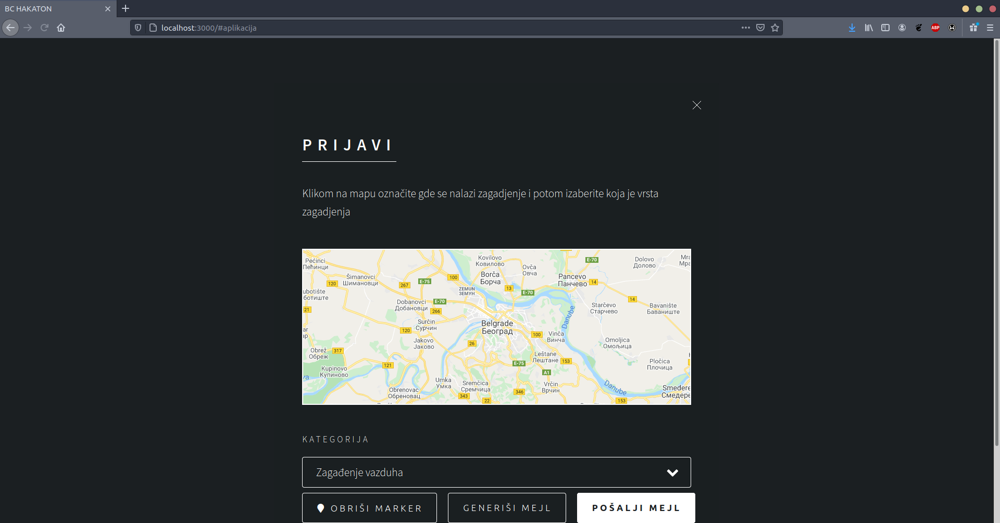

# FraudDetection

Web application designed to ease pollution reporting

## Prerequisites

Npm: <https://www.npmjs.com/>

Python: <https://www.python.org/>

### Description
This project was done for 2020 hackathon by Better Collective. Hackathon theme was ecology, so we decided to make web application that can automate sending 
e-mails anonymously to the institutions that are responsible for the area where pollution is seen. User only needs to click on the exact spot on map, where he noticed 
pollution and to choose what type of pollution he had seen, and then ready to send e-mail with recipient is generated.

Prezi presentation(in Serbian): https://prezi.com/view/05z0zskQOgIh507EQbns/

#### Authors
-   **Momcilo Knezevic**
-   **Stefan Durlevic**
-   **Mihailo Vlajkovic**
-   **Boris Cvitak**
